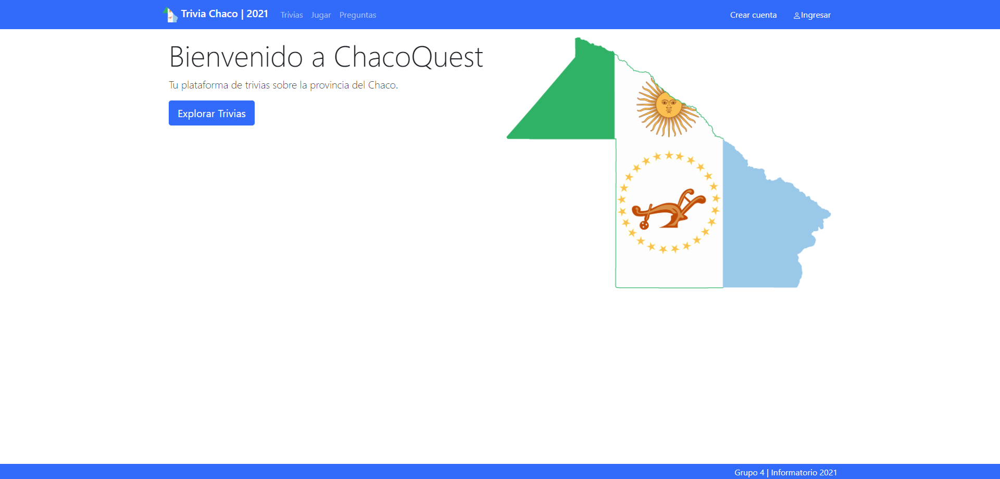
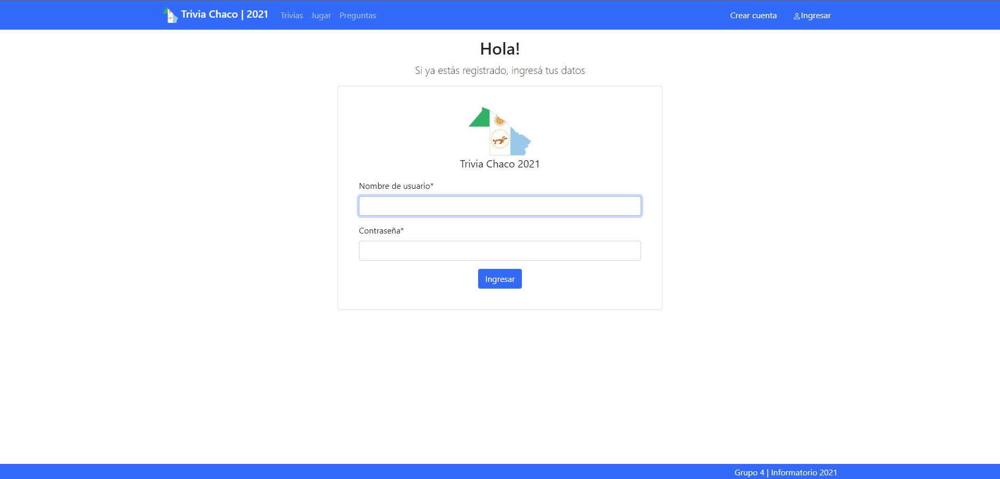
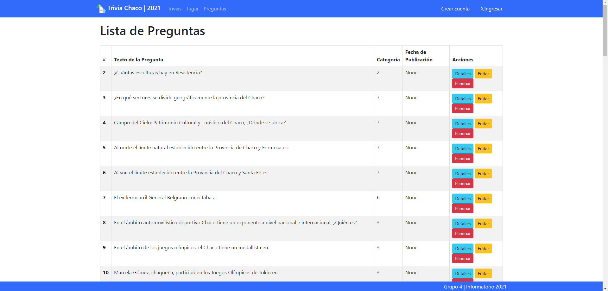

# ChacoQuest - Your Trivia Platform

ChacoQuest is an exciting trivia platform that challenges you to test your knowledge and skills. Dive into a world of intriguing questions and fun answers while competing for glory and recognition in a wide variety of topics.

## Key Features

- **Thematic Trivias:** Choose from a wide range of trivia categories, from history and culture to sports and entertainment.

- **Difficulty Levels:** Adjust the difficulty level to match your experience and challenge your skills.

- **Questions and Answers:** Find carefully selected challenging questions and informative answers.

- **Scores:** Keep track of your scores and compete for top spots in the global leaderboard.

- **Intuitive User Experience:** Enjoy a simple and attractive user interface that allows you to dive into the fun without complications.

## How to Get Started

1. **Clone the Repository:** `git clone https://github.com/Marigiko/ChacoQuest.git`

2. **Navigate to the Project Directory:** `cd ChacoQuest`

3. **Install Requirements:** `pip install -r requirements.txt`

4. **Run Migrations:**
   - `py manage.py makemigrations`
   - `py manage.py migrate`

5. **Run the Project:** `py manage.py runserver`

## How to Begin

1. **Registration:** Create an account or log in with your existing profile.

2. **Exploration:** Browse through trivia categories and choose your favorite.

3. **Challenge:** Start the trivia and put your knowledge to the test!

4. **Results:** Check your scores and improve your skills to become the best ChacoQuest player.

## Contribution

Your contribution is valuable to help grow ChacoQuest! If you have ideas for new trivias, exciting features, or platform improvements, feel free to contribute or inform us of your suggestions.

## Contact

For any inquiries, please don't hesitate to contact us at [marioaquinojob@gmail.com](mailto:marioaquinojob@gmail.com) or visit our website at [keyzdev.free.nf](http://keyzdev.free.nf/).

Thank you for joining the exciting ChacoQuest experience!
